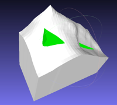
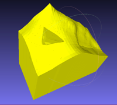
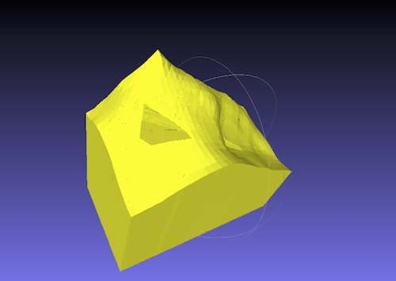
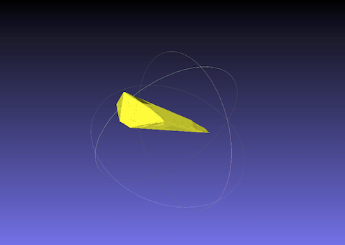

# CSG.py

A Python port of [CSG.js](http://evanw.github.io/csg.js/) by Evan W.






## Usage

CSG.py can be used like CSG.js.

Refer to this example script.

- it reads 2 solids from PLY formatted files.
- it operates union/subtract/intersect.
- it writes results to PLY formatted files.

```
#!/usr/bin/env python
# coding: utf-8

import os
import sys
sys.path.append(os.path.abspath(os.path.realpath(os.path.dirname(__file__)) + "/../src"))

import ply_reader
import ply_writer
import csg_builder

def read_as_csg(path):
    solid = ply_reader.read(path)
    return csg_builder.csg_from_solid(solid)

def operate(op, csg_a, csg_b):
    if op == "union":
        csg = csg_a.union(csg_b)
    elif op == "subtract":
        csg = csg_a.subtract(csg_b)
    elif op == "intersect":
        csg = csg_a.intersect(csg_b)
    else:
        print "unknown op=%s" % op
        return

    solid = csg_builder.csg_to_solid(csg, as_tri=True)

    path = op + ".ply"
    print "write %s" % path

    writer = ply_writer.PLYWriter(path)
    writer.face_color = [255, 255, 0]
    writer.write_solid(solid)
    writer.close()

csg_a = read_as_csg("data/a.ply")
csg_b = read_as_csg("data/b.ply")

operate("union", csg_a, csg_b)
operate("subtract", csg_a, csg_b)
operate("intersect", csg_a, csg_b)
```
